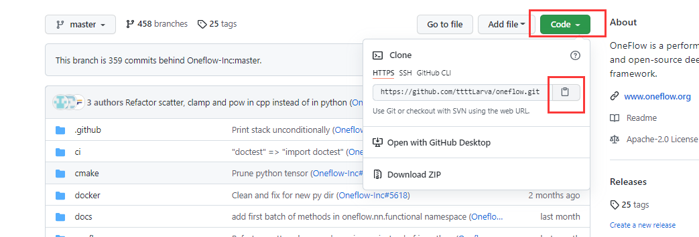

--------


[TOC]


---------
#什么是PR
什么是PR
PR：pull request拉取请求
PR可以让我们在GitHub上，告知其他人，我们已经推送到仓库某个分支中的更改。
#怎么提交PR
如果我们想要对别人的仓库（不是自己的！），贡献代码
也就是说如果我向给别人的代码加点料，那我就要提交PR啦~。
接下来以我（小糖）向OneFlow（大佬）仓库提交PR为例，来给大家瞅瞅怎么提交PR
主要有以下步骤：
*****************************************
##1.fork仓库
为啥要fork仓库？
因为我们对别人的仓库的权限是阅读权限，但是要创建分支的话，就必须对这个仓库有写入权限。
如果要为PR的提交创建新分支，又没有仓库的写入权限（雪上加霜），那还怎么提交PR呢？
解决办法：先复刻别人的仓库，也就是说将别人的仓库copy到我们自己名下~hhhh

具体操作：点开OneFLow的仓库，点击右上jio的Fork按钮，接着就可以在自己的账号下，看到OneFlow的仓库啦~

*****************************************

##2.拉取最新代码
提交PR，是因为我们想对别人的代码 “ 贡献  ” 一点力量。那么我们要怎么实际的 “ 贡献  ” 呢？
也就是说我们怎么更改代码呢？
首先要明白我们刚刚Fork的OneFLow的代码是在自己的账号下，在GitHub的远程服务器的，要想修改，就得拉近我们和代码的距离，也就是将远程分支的代码拉取到本地。
怎么做呢？
首先复制仓库名：
在自己仓库中的OneFLow仓库页面获取仓库下载路径
接着克隆到本地：
在自己的电脑上选取一个文件夹，打开一个控制台，输入命令：
```
git clone https://github.com/ttttLarva/oneflow.git
git clone <刚刚复制的远程仓库路径>

```
记得常常在本地仓库使用 - git pull - 命令来同步远程分支的最新代码到本地。
关于git命令的学习，推荐廖雪峰的教程，很nice
传送门：https://www.liaoxuefeng.com/wiki/896043488029600
*****************************************

##3.创建新分支进行修改
接下来我们要在本地仓库，先对代码进行修改，作 “ 贡献  ” 。
首先我们要先在本地创建一个新分支（因为我们不要随随便便改动master分支，秉着谨慎小心又严谨的原则，我们要开发，就要new一个新的分支，在新分支上进行开发）
怎么创建新分支呢？使用命令
```
git checkout -b new_branch
git checkout -b <新分支名，建议取名要有意义一丢丢>
```
以上命令，就创建成功了new_branch分支，并切换到new_branch分支上
创建完新分支后，我们就可以在本地上作改动啦，改动完成后就要使用
```
git add xxxx
git commit xxxx
```
一系列命令，将改动提交到本地仓库，可参考https://www.liaoxuefeng.com/wiki/896043488029600/897884457270432
*****************************************

##4.推送到github
提交到本地仓库成功之后，我们就要将改动提交到远程仓库啦，使用命令：
```
git push origin new_branch
git push origin <远程仓库的分支名>

```
我们要推送到github的远程仓库，其中origin指的是远程仓库-OneFLow的原生仓库
后接的远程仓库分支名，强烈建议和本地分支保持一致。
*****************************************

##5.创建PR
在push到远程仓库成功后，控制台会出现一个链接，我们把这个链接复制到浏览器打开，就可以跳转到创建PR的界面：

以上左边红色：代表我们要想要把这个改动合并到OneFlow的哪一个分支
以上右边蓝色：代表我们前面改动的分支
接着就是一些信息填写啦，写好标题和对这笔改动的描述，点击Create按钮，PR就创建成功了。


最后我们就可以在OneFLow的仓库下看到我们提交的PR啦

